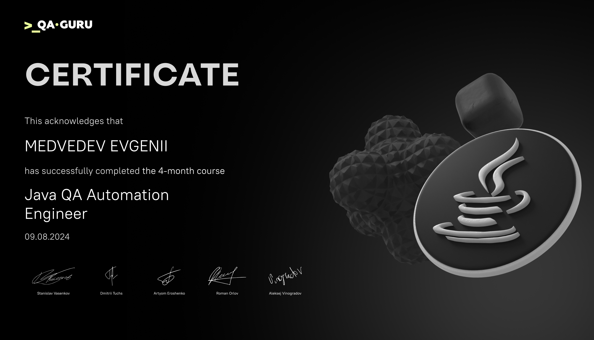
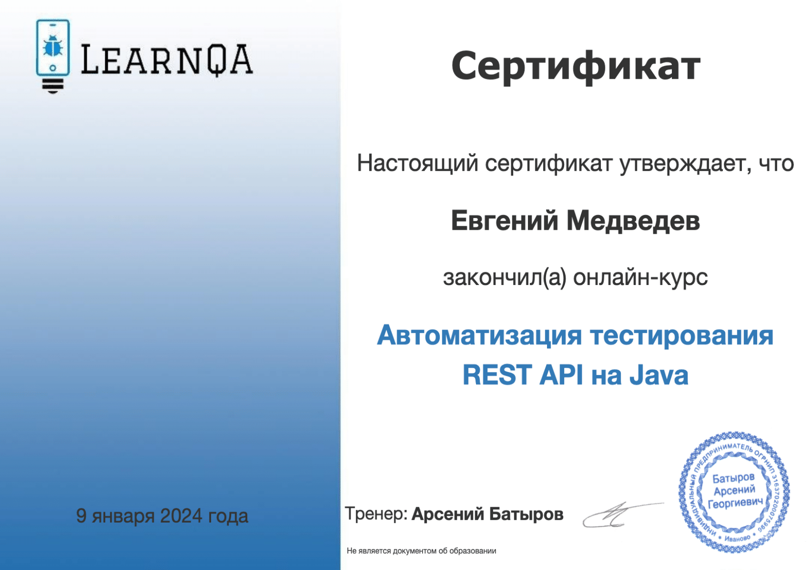
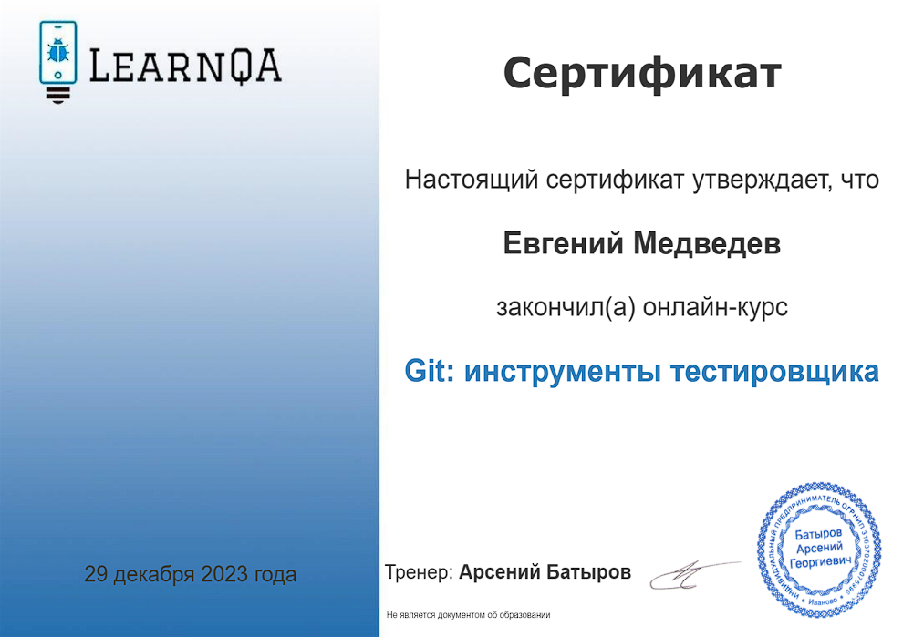
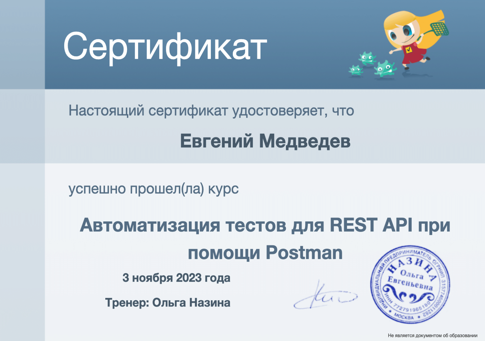
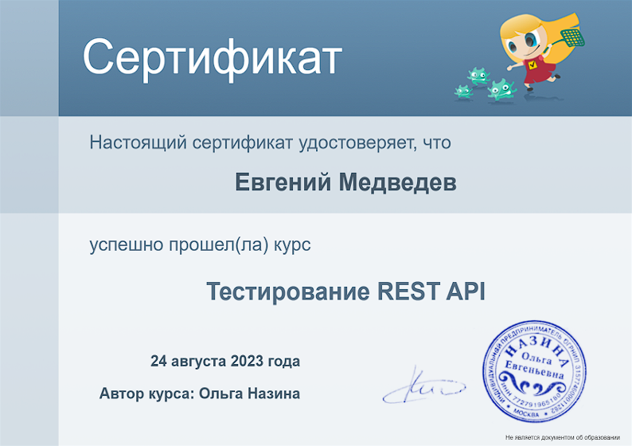
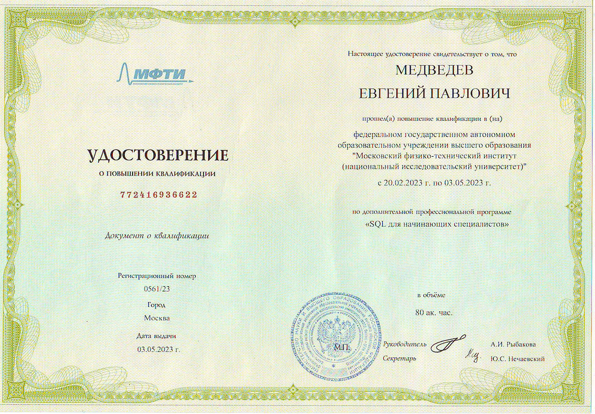

### 💬 Обо мне
<h1 align="center">Привет, я Женя, Fullstack QA Engineer  👋 </h1> 

 - :technologist: С 2022 года работаю **Java QA Automation** в компании <a href="https://rtkit.ru/">**РТК ИТ**</a>
 - :astronaut: Изучаю автоматизацию тестирования на Java
 - :books: Закончил курс для инженеров по автоматизации тестирования https://qa.guru

### Опыт
- QA Automation Engineer  с 3-летним опытом создания надежных и поддерживаемых решений для автоматизации тестирования.
- Большой опыт в WEB-тестировании и API-тестировании с использованием JAVA, включая разработку тестовых платформ с нуля. 
- Специалист по проектированию архитектуры тестирования, процессам CI/CD.
- Есть опыт в создании и актуализации тестов для старых сервисов с подготовкой документации. 
- Уверен как в автоматизации, так и в ручном тестировании с акцентом на качество продукта и его доставку.
- Отлично разбираюсь в подходах к гибкой разработке, особенностях тестирования в таких условиях и имею опыт работы в кросс-функциональных распределенных командах.

    

### Резюме 
Посмотреть на [hh.ru](https://hh.ru/resume/f647144cff0af131730039ed1f316b4d303936); посмотреть в [гугл доке](https://docs.google.com/document/d/1WKD2R_tSI9F0Xe3Kad1GpMHp-yPHEVhk/edit)

### Связаться со мной можно тут

  <a href="https://t.me/medvedevep">
    

  <a href="mailto:medvedev-qa@mail.ru">
    

  <a href="https://www.linkedin.com/in/medvedev-evgeny/">
    

  <a href="https://github.com/Tverskoy31"> 
    

    
  <a href="https://career.habr.com/tverskoy31">
    
  

### 🎓 Образование: высшее техническое
<table>
  <tr>
    <td valign="middle" align="center" width="120">
      
    </td>
    <td valign="middle">
      <b>Рязанский государственный радиотехнический университет</b> 
      Факультет автоматизации информационных и технологических процессов 
      <a href="https://rsreu.ru/">РГРТУ</a>
    </td>
  </tr>
  <tr>
    <td valign="middle" align="center" width="180">
      
    </td>
    <td valign="middle">
      <b>Школа инженеров по автоматизации тестирования</b> 
      <a href="https://qa.guru">qa.guru</a>
    </td>
  </tr>
</table>

### ⚒️ Мои инструменты и технологии

 

 
 

 
 
  
   
  
  

### 📖 Сертификаты

---

  
Курс "Автоматизация тестирования на Java" от QAGURU (08.2024г.)

    

---

  
Курс "Автоматизация тестирования REST AРІ на Java" от LearnQA (01.2024г.)

    

---

  
Курс "Git: инструменты тестировщика" от LearnQA (12.2023г.)

    

---

  
Курс "Bash: инструменты тестировщика" от LearnQA (12.2023г.)

    

---

  
Курс "Автоматизация тестов для REST API при помощи Postman" от Ольги Назиной (11.2023г.)

    

---

  
Курс "Тестирование REST API" от Ольги Назиной (08.2023г.)

    

---

  
Курс "SQL для начинающих специалистов" на базе МФТИ (05.2023г.)

    

---

### Моя статистика:

